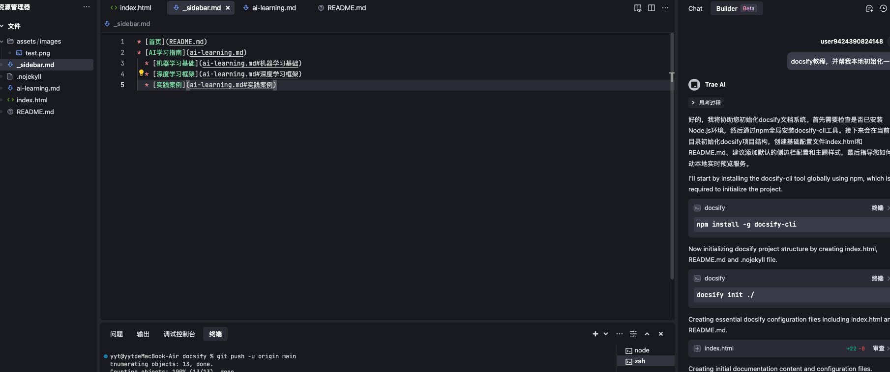

# AI学习指南

## 机器学习基础
1. 监督学习与无监督学习
2. 常见算法：线性回归、决策树、SVM
3. 模型评估指标（准确率、召回率、F1值）

## 深度学习框架
### TensorFlow
- 计算图概念
- Keras API使用示例

### PyTorch
- 动态计算图优势
- 自动微分实践

## 实践案例

## 可视化案例
```python
import matplotlib.pyplot as plt
import numpy as np

# 生成示例数据
x = np.linspace(0, 10, 50)
y = 2*x + 1 + np.random.randn(50)

plt.scatter(x, y)
plt.plot(x, 2*x + 1, color='red')
plt.title('线性回归示例')
plt.xlabel('X轴')
plt.ylabel('Y轴')
plt.savefig('assets/images/linear-regression-demo.png')
```



> 提示：使用相对路径引用图片文件，图片应保存在assets/images目录下
1. 手写数字识别（MNIST）
2. 自然语言处理情感分析
3. 目标检测YOLO实现

```python
# 简单线性回归示例
import numpy as np
from sklearn.linear_model import LinearRegression

X = np.array([[1], [2], [3]])
y = [2, 4, 6]
model = LinearRegression().fit(X, y)
```