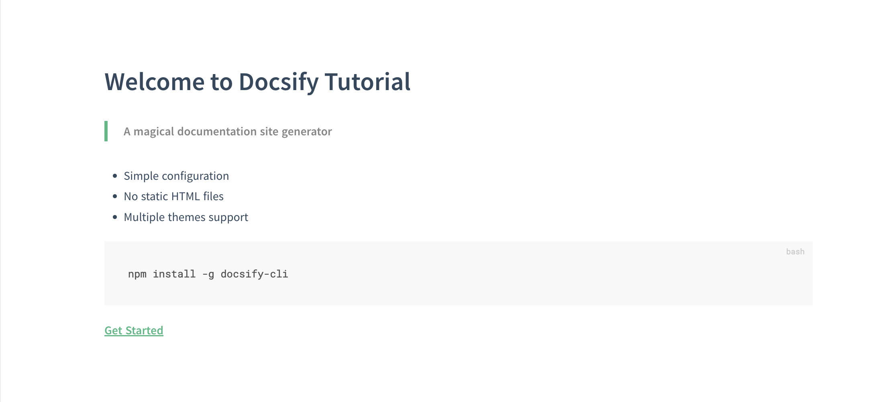
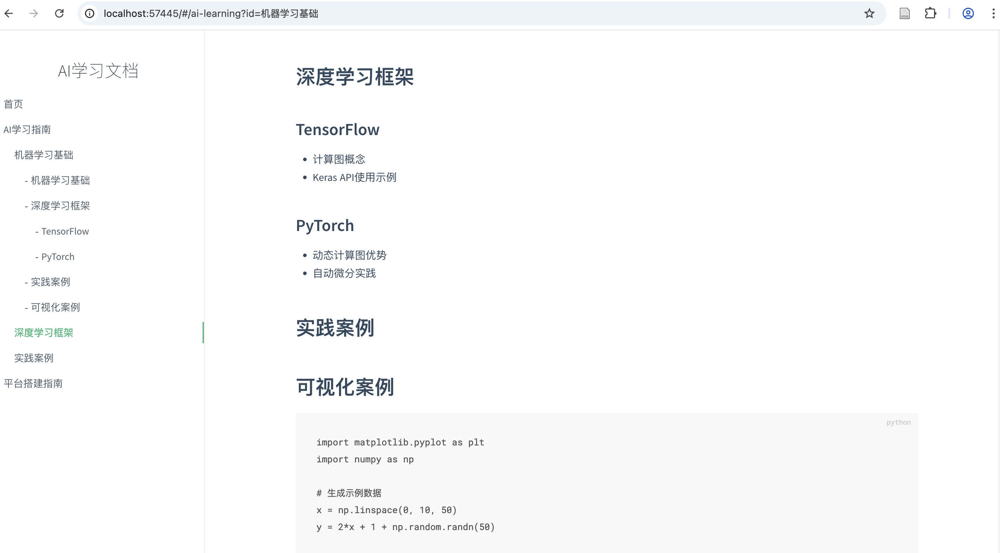

# 使用docsify + trae搭建个人知识平台
```
docsify:一个神奇的文档站点生成器
trae:国内AI IDE
```
## 一. 环境准备
```bash
1、安装trae，推荐国际版
国际版：https://www.trae.ai/
国内版：https://www.trae.com.cn/
2、安装node（可以使用trae安装）
3、安装git（可以使用trae安装）
```

## 二. 安装docsify
1. 使用trae帮我安装docsify，使用builder模式，全部接受它提示的命令，执行完成便可以本地启动，根据提示访问页面  
提示词：docsify教程，并帮我本地初始化一份

2. 访问界面

3. 界面没什么内容让trae生成几篇ai相关的文档  
提示词：根据你刚才生成的docsify，利用它帮我写一篇ai学习相关的文档

预览查看效果


## 三. 部署到github上  
提示词：把你刚才做的docsify部署到github上，要怎么做  

其中git提交的时候-m后面没有加引号，命令报错之后它修改了三次，才成功提交上去

后续配置仓库，选择分支之类的操作，没让trae自动实现，自己手动去github上修改了  
可以参考github官方教程：https://docs.github.com/en/pages/getting-started-with-github-pages/configuring-a-publishing-source-for-your-github-pages-site
  
trae提示的操作流程：已完成Git仓库初始化及首次提交，请继续以下步骤：

1. 在GitHub创建新仓库（如ai-learning-docs）
2. 执行推送命令（注意替换用户名和仓库名）：
```plaintext
git remote add origin https://github.com/你的用户名/仓库名.git
git branch -M main
git push -u origin main
 ```

3. 在GitHub仓库设置中启用GitHub Pages，选择分支或docs目录
4. 访问地址将显示为： https://你的用户名.github.io/仓库名/  

## 五、 查看github部署效果
访问https://你的用户名.github.io/仓库名/  

例如我的：https://yeyangtao.github.io/doc/

## 六、总结
使用trae可以实现大部分简单功能自动化了，但是由于模型或者其他限制，有些步骤可能会一直卡着，此外还需要拥有linux及一些编程基础